+++
date = '2025-05-12T19:08:19+08:00'
draft = false
title = 'A Trip to Japan'
+++

On January 7, 2025, I traveled to Japan. I should have documented this experience sooner, but upon my return, I was occupied with preparations for Google Summer of Code (GSoC), leaving me with little time. Fortunately, I was eventually chosen for GSoC, so I have decided to pen a blog post to commemorate this unforgettable journey.

I stayed in Japan for about ten days and saw a lot of new things. It was just like I imagined Japan would be. I visited three cities: Osaka, Kyoto, and Tokyo. Each city has its own unique features and left a deep impression on me.

#### January 7

On January 7th at noon, I landed at Kansai International Airport in Osaka. Before landing, I looked out the window and was amazed to see that Japan is really an island in the sea. I was born in China, so I had never seen this kind of landscape before. After landing, we took the airport bus to the subway station. On the way, looking at the sea outside the bus reminded me of [EVA](https://en.wikipedia.org/wiki/Neon_Genesis_Evangelion), but in EVA, the sea is red! XD

After that, I took the subway to [Namba](https://en.wikipedia.org/wiki/Namba). My hotel was nearby, close to many famous places. I quickly spoke a little in English with the hotel’s front desk and couldn’t wait to go out and have fun. Right outside my hotel was [Shinsaibashi](https://en.wikipedia.org/wiki/Shinsaibashi), so that was my first stop.

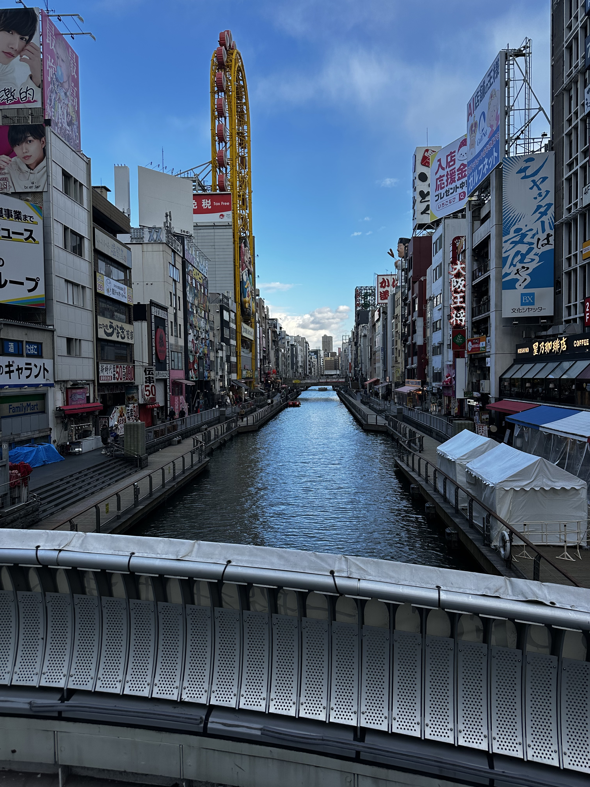
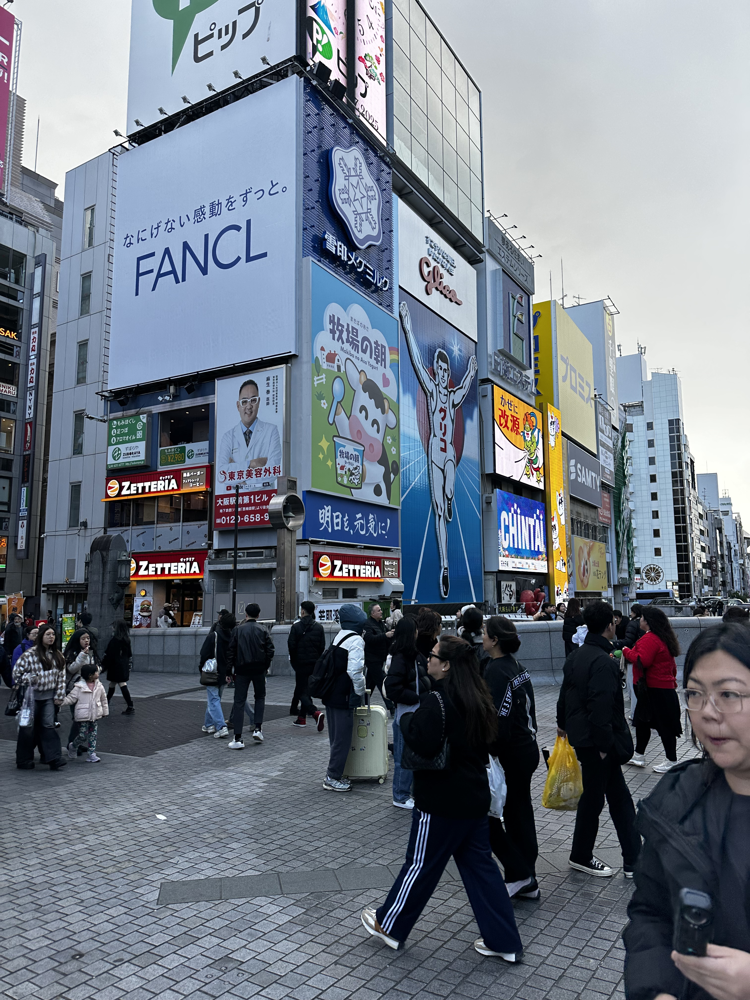
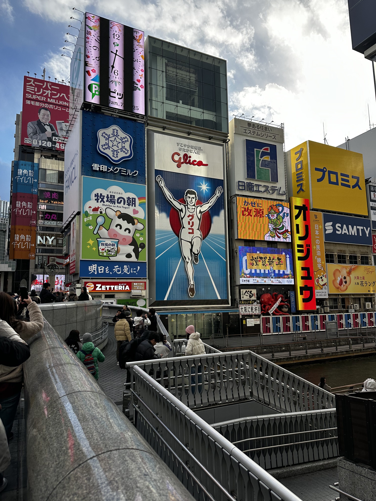

Shinsaibashi is really a beautiful place and matches my impression of Osaka's retro style. There were many tourists, almost all of them were foreigners. After that, I ate some food there. It looked very pretty, but it wasn't as delicious as I expected.

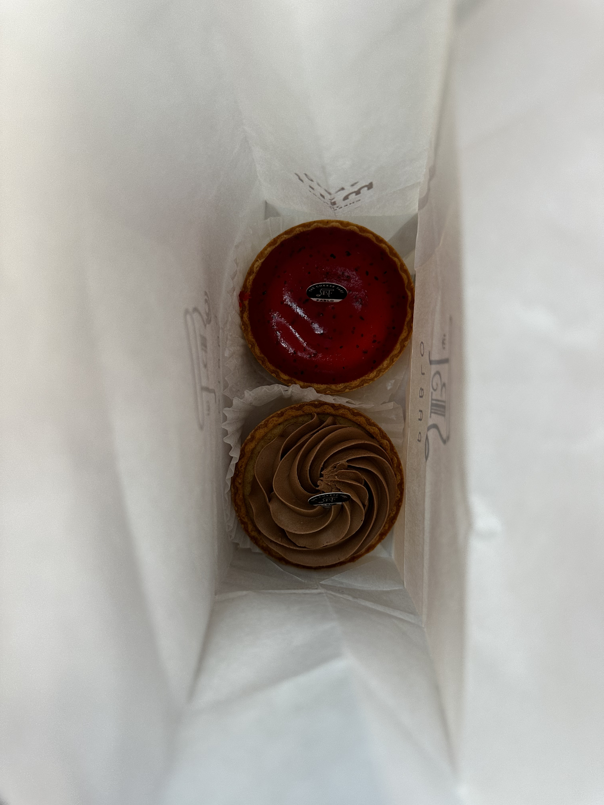
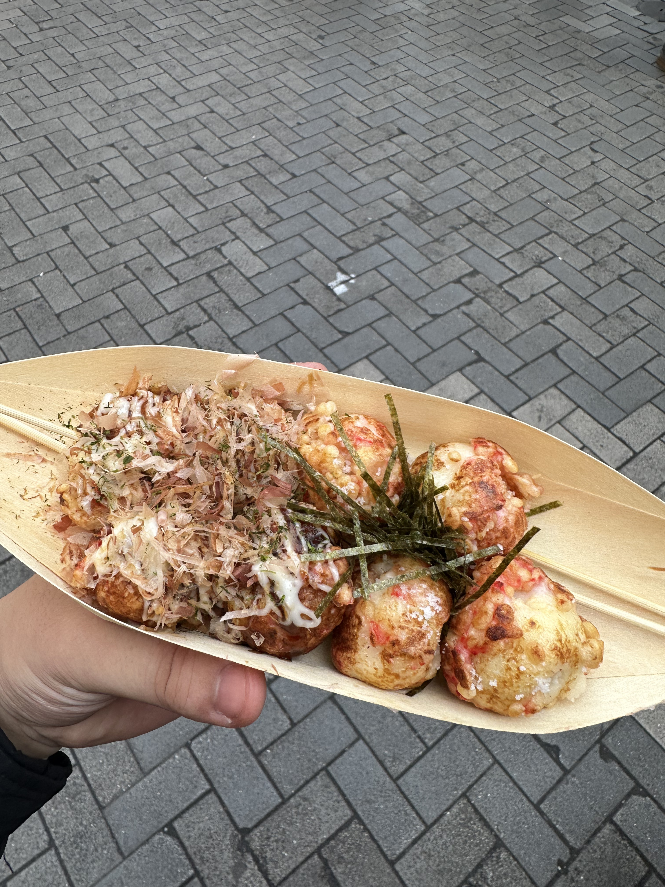

Each shop looked very fancy, and what left a deep impression on me was the big crab. That is really huge.

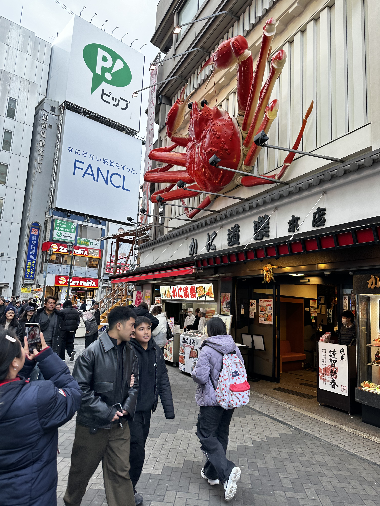

Because I don’t exercise much, I went back to the hotel to rest for a while. In the evening, I went out for a walk again. [Dotonbori](https://en.wikipedia.org/wiki/D%C5%8Dtonbori) is near Shinsaibashi. I went there to walk around, and there were izakayas everywhere.

They looked very tempting, but I had already decided what to eat for dinner, so I resisted the temptation and went back.  Since I was really hungry, I went straight to my destination for the night—[Ichiran Ramen](https://en.wikipedia.org/wiki/Ichiran). I waited in a long line, and when I finally got to eat, it was incredibly tasty! The noodles were chewy, the broth was clear but very rich in flavor, the beef slices melted in my mouth, and the soft-boiled egg was perfect. It was so good that after finishing one bowl, I ordered another one!

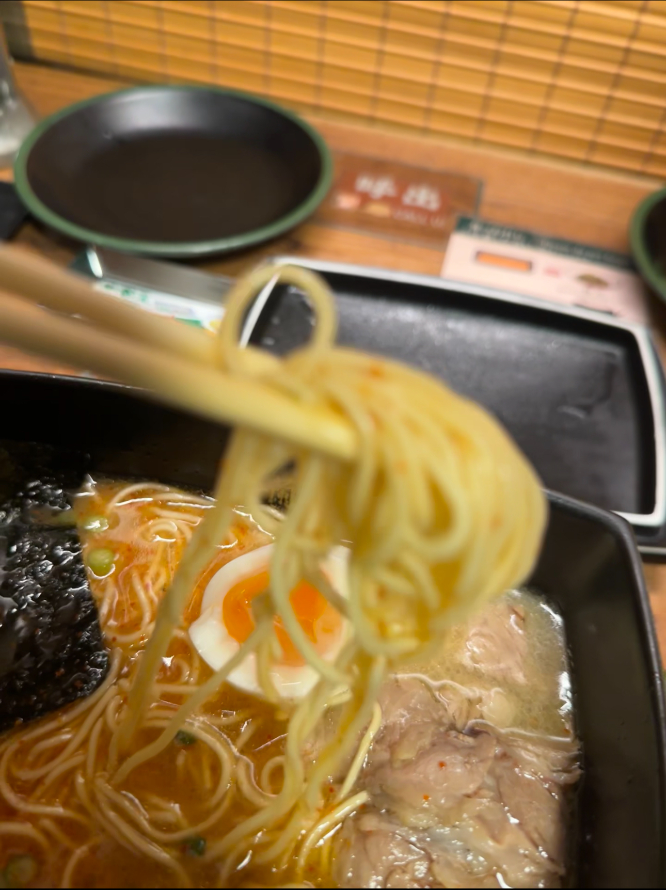

After eating and drinking enough, I went back to the hotel to get some good rest, preparing for a crazy day of traveling the next day.

#### January 8

It was also a perfect day. I woke up around 8:00 and went to my destination for today—[Universal Studios](https://en.wikipedia.org/wiki/Universal_Studios_Japan). When I arrived, the doors were already open. Before I even went inside, I heard people screaming from the roller coasters, which was quite shocking.

The first place I visited was the Harry Potter theme park, and it really felt incredibly authentic. Some people were waving their wands, which they had bought from the themed shop, and dramatically reciting spells at specific attractions. I also got to see a magnificent replica of Hogwarts Castle.
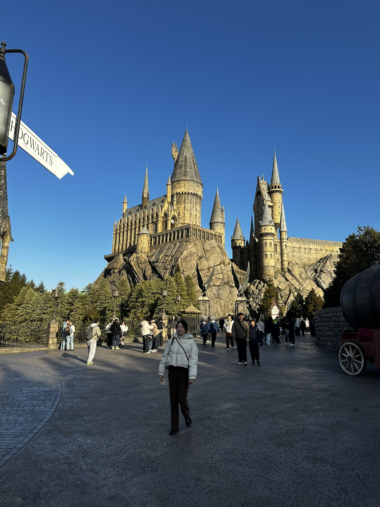

Then I visited the much-talked-about [Super Nintendo World](https://en.wikipedia.org/wiki/Super_Nintendo_World). Although I ended up waiting in line for quite a while, it wasn't as fun as I had imagined. That said, the attention to detail in the scenery and set design was truly impressive!

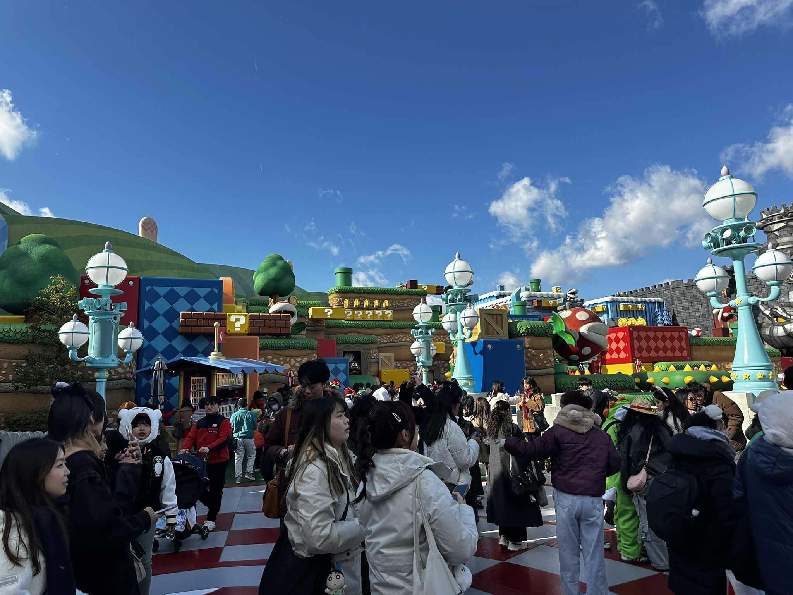

I got to enjoy some delicious food! The sandwiches with fries at the Jaws-themed restaurant were fantastic, and the classic English dinner at the Harry Potter-themed restaurant was absolutely amazing. What a treat!

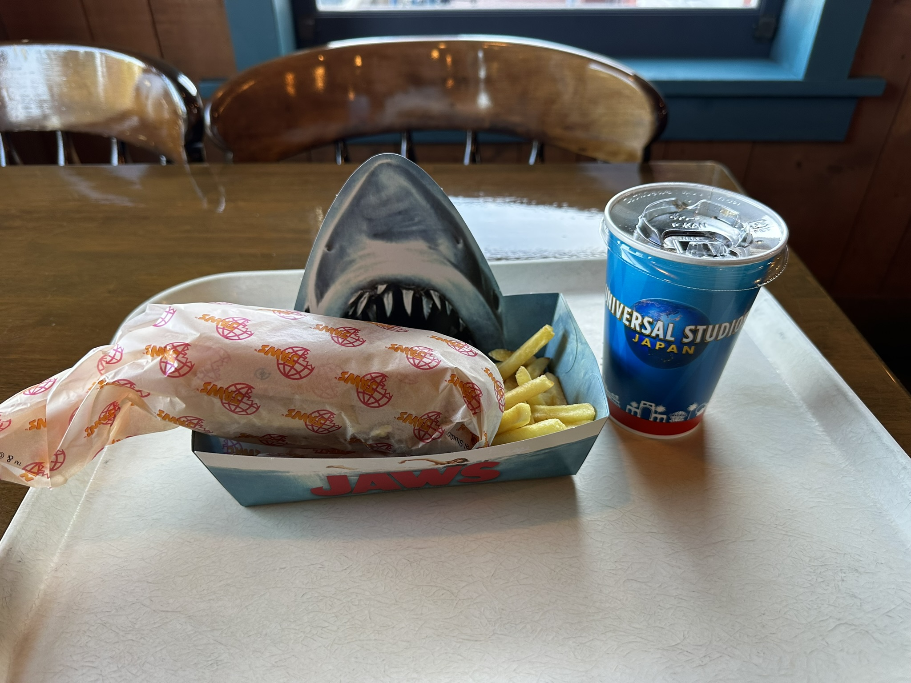

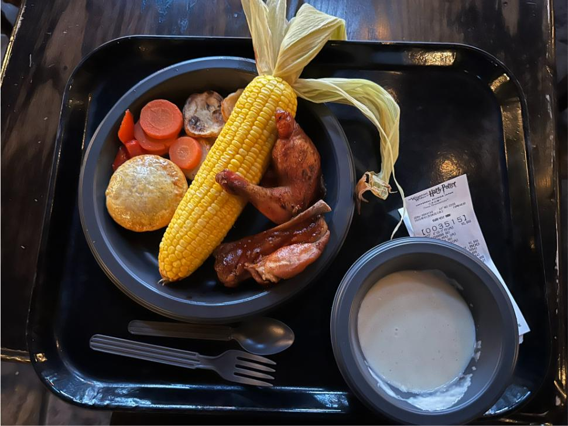
