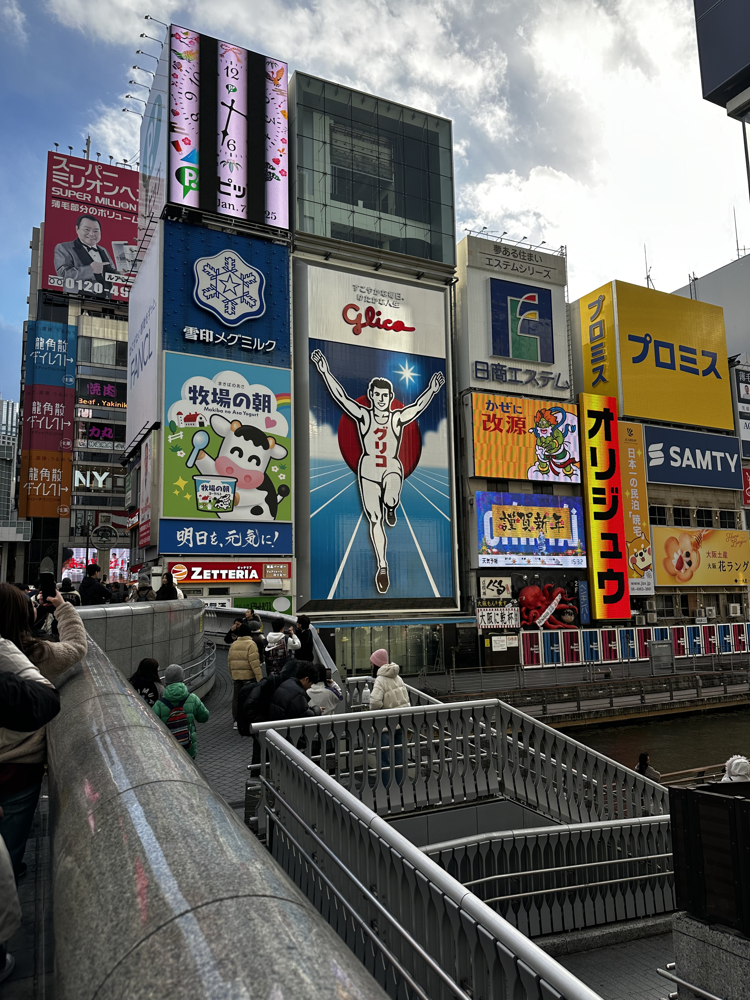
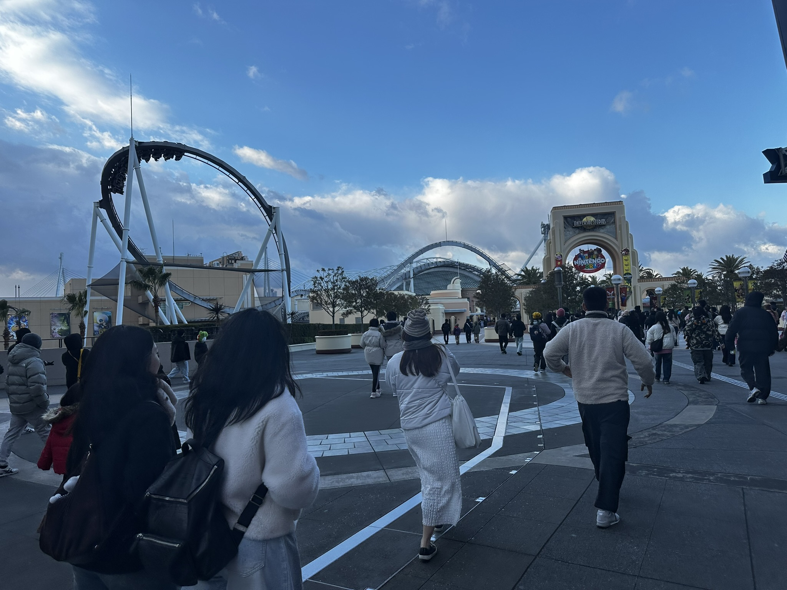
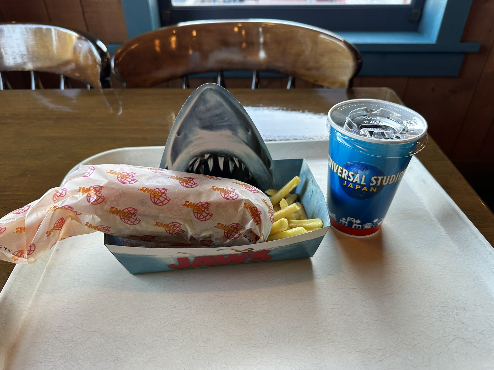

+++
date = '2025-05-12T19:08:19+08:00'
draft = false
title = '日本之旅'
+++

2025 年 1 月 7 日，我去日本旅行了。我本该早点记录这段经历的，但回来后，我忙于准备 Google Summer of Code (GSoC)，几乎没有时间。幸运的是，我最终入选了 GSoC，所以我决定写一篇博客文章来纪念这段难忘的旅程。

我在日本待了大约十天，看到了很多新奇的事物。我去了三个城市：大阪、京都和东京。每个城市都有其独特的特色，给我留下了深刻的印象。

## 大阪

### 1 月 7 日

1 月 7 日中午，我降落在大阪关西国际机场。降落前，我望向窗外，看到日本真的是海上的岛屿，还是感到不可思议。降落后，我们需要乘坐机场巴士去地铁站。在路上，看着窗外的大海，让我想起了 [EVA](https://en.wikipedia.org/wiki/Neon_Genesis_Evangelion)，但在 EVA 里，海是红色的。

之后，我坐地铁去了 [难波](https://en.wikipedia.org/wiki/Namba)。我的酒店就在附近，靠近很多著名的地方。我很快和酒店前台简单交流了一下，就迫不及待地出去了。我的酒店外面就是 [心斋桥](https://en.wikipedia.org/wiki/Shinsaibashi)，所以那是我的第一站。

心斋桥是一个很热闹拥挤的地方，感觉有一种昭和时期的奢侈和繁华，符合我对大阪复古风格的印象。有很多游客，几乎全是中国人。之后，我在那里吃了一些东西。看起来很有食欲，但没我想象的那么好吃。

每家店看起来都很豪华，给我留下深刻印象的是那只大螃蟹。真的很大。

因为我平时不太运动，逛一会就累了，所以我回酒店休息了一会儿。晚上，我又出去散步了。[道顿堀](https://en.wikipedia.org/wiki/D%C5%8Dtonbori) 就在心斋桥附近。我去那里逛了逛，到处都是居酒屋。夜晚的大阪极具特色，跟白天人们急急忙忙到处奔波的气氛不同，有一种放纵的感觉。

它们看起来很诱人，但我已经决定好晚饭吃什么了，所以我抵制住了诱惑回去了。因为我真的很饿，所以我直接去了今晚的目的地——[一兰拉面](https://en.wikipedia.org/wiki/Ichiran)。我排了很长的队，当我终于吃到的时候，简直太好吃了！面条很有嚼劲，汤头清澈但味道浓郁，牛肉片入口即化，溏心蛋也很完美。太好吃了，吃完一碗我又点了一碗！

吃饱喝足后，我回酒店休息，准备第二天的环球影城的旅行。

### 1 月 8 日

这也是完美的一天。我早上 8:00 左右醒来，前往[环球影城](https://en.wikipedia.org/wiki/Universal_Studios_Japan)。我到达时，大门已经开了。还没进去，我就听到过山车上传来的尖叫声，真的非常震撼。

我去的第一个地方是哈利波特主题公园，还原的非常好。有些人挥舞着从主题商店买来的魔杖，在特定景点念着咒语。我还看到了一座宏伟的霍格沃茨城堡。

然后我去了备受瞩目的 [超级任天堂世界](https://en.wikipedia.org/wiki/Super_Nintendo_World)。虽然我最后排了很长时间的队，但并没有想象中那么好玩。不过，布景和舞台设计的细节真的让人印象深刻。

我在环球影城吃到了一些美味的食物。我在大白鲨主题餐厅点了薯条三明治套餐，薯条微微的咸味和美味多汁的三明治，再加上解腻的加冰可乐，标准的美式白人饭，但是味道确实很好。

哈利波特主题餐厅的经典英式晚餐出乎意料。我受不了蘑菇汤和没有调味的胡萝卜，但是甜玉米，鲜嫩多汁的鸡腿，抹着美味酱汁肉排和多汁的馅饼却很好吃。

